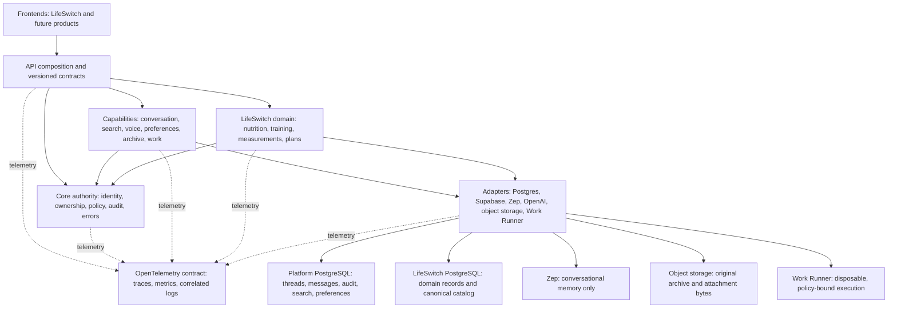

# SeeBx structural design map v1

Status: controlling cleanup map; no deployment, migration, or deletion authority

Evidence date: 2026-08-22 America/Chicago

Production authority: `49f9e60cf4321c8e42c359845c1a62a8c987614d`

Candidate evidence:

- Batch 01, dead Qdrant runtime surface: `10b5cb4a`
- Batch 02, core actor identity extraction: `fb252149`
- Batch 03, conversation memory contract extraction: `d06549df`
- Structural target, component, and database ledgers: `65a98f2a`
- Conversation persistence consolidation: `da426677`
- Voice synthetic canary contract repair: `e7005538`
- Voice contract vocabulary alignment: `d39476d3`
- Canonical search capability package: `6cf361ec`
- Shared search runtime boundary: `3caf9ac1`
- Search audit, wrappers, authorization, planning, evidence, provider, and
  registry ownership: `685703e7`, `7f9a49a4`, `c38149c2`, `30ecece6`,
  `07c80b71`, `64c8f321`, `0986ca9b`
- Search audit capability and PostgreSQL effect separation: `7ffb6b82`
- Remaining search transcript and cache PostgreSQL effect separation: `b2b6311f`
- Shared voice-language contract extraction: `f8b73bf1`
- Shared OpenAI adapter extraction and rotation-safe cache: `0a1a4ba2`
- Unified conversation and search transcript persistence: `d8d40adc`
- Conversation persistence, transcript-integrity, and active-thread database boundary: `d247da49`
- Canonical request identity, ownership, and Supabase adapter extraction:
  `a20e9634`
- Voice session authority, storage, and HTTP capability separation: `381704fb`
- Canonical voice observability and realtime session-state placement: `92adf9e3`
- Voice transcription capability and OpenAI adapter separation: `f3889883`
- Voice synthesis capability and OpenAI TTS adapter separation: `03a4657f`
- Realtime preview capability and OpenAI negotiation/config separation: `c9a552df`
- Realtime sideband capability and OpenAI WebSocket transport separation: `64cd487e`
- Realtime governed-turn loopback transport containment: `fd360921`
- Shared conversation-owned Zep runtime and prompt settings: `25be0d0a`
  (candidate only; not deployed)
- Conversation attachment contract and PostgreSQL read boundary: `988596bd`
- Conversation attachment CRUD HTTP/PostgreSQL boundary and shared identifier contract: `b1a6b3bd`
- Conversation attachment message-binding PostgreSQL boundary: `7b6ed07e`
- Conversation thread-history PostgreSQL read boundary: `92745e3b`
- Conversation thread metadata PostgreSQL boundary: `6e1c6e51`; owner lookup: `c210e2d8`
- Atomic user-transcript PostgreSQL boundary: `62b5178c`
- Shared application PostgreSQL connection/session boundary: `2497b9e7`
- Verified thread request-identity boundary: `63e2e45a`; paired Verbal Sage bearer-forwarding candidate: `c25502b`
- Canonical conversation router placement without compatibility wrapper: `b56d0e84`
- Role-named conversation and LifeSwitch composition: `5ed33124`
- Shared cross-capability search contract: `bed831f5`
- Conversation snapshot contract and PostgreSQL adapter separation: `e89018de`
- Canonical content-free conversation usage writer and dormant admin-reporting
  retirement: `c6285574`
- LifeSwitch response plan, answer binding, and provenance contract placement:
  `6f1272a1`
- Canonical normalized muscle capability and compatibility projections:
  `58897442`
- Clean schema/role baseline generator and fail-closed validation correction:
  `d647cfe9`, `37770d0b`

## Current verified checkpoint

The integration candidate and its GitHub branch begin this batch at
`3b79f53e756e8f7e1e2578c4c48a06f7b5d7c3c2`. Since the earlier structural
inventory it has also completed the Catalog, Forms, Measurements, and AI
Operations PostgreSQL adapter separations.

At this checkpoint:

- `app.py` is a 152-line composition root with 26 router mounts, zero direct
  route decorators, and zero SQL;
- the candidate exposes 138 routes and 124 OpenAPI paths with route SHA-256
  `dacb3665272ec6720fb477340c9d84d977a6af55fae4f061972526eabe10353d`
  and OpenAPI SHA-256
  `44e8aa5f364f85aef4d4fb4fa2596af4ab3eb219a2a82e21d54fbd2768c71091`;
- all 1,328 locked-runtime tests pass after the Training strength-session/set-log adapter extraction;
- `rag_engine` has zero tracked files and zero files on disk;
- retained capability packages have zero raw PostgreSQL query or request-owned
  connection effects; Nutrition retains three adapter-mediated transaction
  scopes, and the remaining Nutrition and Training work is logical module split
  plus production verification rather than database-effect extraction.
- the 218-object LifeSwitch disposition now produces a schema-only clean-install
  package. Its digest-pinned Work Runner restore proves exact exclusions,
  `NOLOGIN` roles, canonical normalized muscle tables, app-role adapter behavior,
  all 1,385 backend tests, and mandatory disposable cleanup.

The current conversation gate is Zep lifecycle proof and versioned retirement
of compatibility vocabulary, not further conversation SQL extraction. The
seam descriptions below retain progression history; interim next-step phrases
are superseded by this checkpoint where they conflict.

The current runtime service, timer, container, database, and cron disposition is
tracked in `docs/SEEBX_RUNTIME_ASSET_LEDGER_V1.md`.

## Purpose

This map is the organizing boundary for cleanup. It answers four questions for
every retained file, route, database object, service, and external product:

1. Which structural plane owns it?
2. What is it allowed to depend on?
3. Is it canonical, transitional, derived, or retired?
4. What evidence is required before it moves or disappears?

The map prevents cleanup from becoming a sequence of local patches. A file is
not retained because it is old or deleted because its name is stale. It is
classified against a declared capability, authority boundary, caller, data
owner, and replacement path.

## Target system map



### Plane ownership

| Plane | Owns | Must not own |
|---|---|---|
| Frontend | presentation, local interaction state, product UX | identity authority, database credentials, provider secrets, cross-owner policy |
| API composition | route mounting, request/response translation, contract versions | domain SQL, prompt construction, provider clients, retirement stubs |
| Core authority | verified actor, owner binding, authorization, audit envelope, stable errors | product behavior, provider selection, SQL queries |
| Capability | one use-case service and its contracts | another capability's router, raw provider objects, hidden database fallback |
| Adapter | provider-specific API/SQL/runtime mechanics | product policy, caller identity inference, alternate business flows |
| Data | canonical records or explicitly derived provider state | ambiguous duplicate write authority |
| Work Runner | disposable workspace and approved tool execution | production credentials, production checkout mutation, deployment authority |
| Observability | correlated evidence about execution | authorization decisions or canonical product data |

## Dependency rules

Allowed production dependency direction:

```text
frontend -> versioned API contract
router -> core authority + capability service
capability service -> contract + adapter interface
adapter -> external provider or declared database
all planes -> telemetry interface
```

Forbidden crossings:

- router to raw SQL or provider SDK;
- capability to another capability's router;
- reusable core to LifeSwitch domain code;
- response orchestration to nutrition/training SQL;
- Zep or a vector store acting as transcript, identity, deletion, or domain-data authority;
- LifeSwitch database fallback to the platform database;
- frontend state or request fields acting as owner authority;
- SeeBx service invoking an unrestricted Work Runner shell;
- model-directed execution receiving production credentials or writable
  production mounts.

Temporary compatibility adapters are permitted only when they name their
remaining callers, have contract tests, emit usage evidence, and state an exact
retirement condition.

## Canonical control flows

### Ordinary API request

```text
request
  -> verified actor and owner context
  -> capability policy
  -> one capability service
  -> one or more narrow adapter interfaces
  -> canonical transaction/provider call
  -> stable response plus audit/telemetry
```

### Conversational response

```text
authenticated conversation snapshot
  -> optional Zep context
  -> optional domain/search context contracts
  -> one prompt/composition service
  -> model adapter
  -> durable response and provenance
  -> Zep update
```

There is one live response orchestrator. Experiments and historical versions
remain outside the deployed import graph until selected. Selection replaces a
path; it does not add another permanent router.

### Work job

```text
authenticated request
  -> SeeBx work policy and immutable job contract
  -> durable job record/queue
  -> Work Runner signed intake
  -> disposable repository copies and sandbox
  -> bounded tools
  -> artifacts, test evidence, and signed receipt
  -> human review/promotion gate
```

The control plane retains identity, approval, policy, audit, and promotion
authority. The sandbox owns only model-directed compute. A successful job is
candidate evidence, never production authority.

## Current-to-target seams

| Current seam | Target seam | Cleanup rule |
|---|---|---|
| 144-line composition-only `app.py` with 26 canonical router mounts | thin packaged application entry point plus capability routers/services | route and SQL extraction is complete; keep the entry point composition-only and defer any module rename until the immutable service command and rollback manifest change together |
| governed-memory actor types in live auth | `seebx.core.identity` | Batch 02 candidate completed; retain compatibility re-export only for named dormant callers |
| legacy response router and version-named composition roots in the current 60-module/24,025-line closure | `seebx.capabilities.conversation` | candidate `b56d0e84` moves the mounted router with no legacy wrapper; `5ed33124` moves both composition implementations and tests into the conversation capability as `ConversationResponseComposer`, `LifeSwitchResponseStage`, and `LifeSwitchConversationComposer`; `7f68089f` places generic and LifeSwitch OpenAI chat contracts under explicit adapter owners; `b9069fa7` places pure prompt assembly under the conversation capability; `6f6ef721` places response orchestration there; `f7a5f7e2` places response policy there; `f89319c8` places generic and LifeSwitch finalization there as distinct versioned contracts; `9438dc52` consolidates inspection into one generic module plus one LifeSwitch module; `c6285574` gives usage persistence one adapter owner; `6f1272a1` places the LifeSwitch response plan, answer binding, and provenance receipt under conversation with no wrappers; next split LifeSwitch context decision logic from PostgreSQL and runtime ownership |
| obsolete LifeSwitch V1 prompt, response-plan, and request generation | none | candidate `7ae253e1` deletes the complete zero-caller generation and its V1-only tests without a compatibility wrapper; retain the immutable historical handoff and explicit anti-reintroduction guards; current LifeSwitch response generation remains V2/V4 |
| OpenAI chat contracts under `rag_engine` | `seebx.adapters.openai_chat` plus `seebx.adapters.lifeswitch_openai_chat` | candidate `7f68089f` moves both live wire-contract/adapter implementations and every active importer with no compatibility wrapper; preserve V1 and V4 wire hashes while generic and LifeSwitch plans remain distinct |
| pure prompt assembly under `rag_engine` | `seebx.capabilities.conversation.prompt` | candidate `b9069fa7` moves the sole provider-free implementation and every active importer with no wrapper; historical path references remain immutable evidence |
| response orchestration and policy under `rag_engine` | `seebx.capabilities.conversation.orchestration` and `seebx.capabilities.conversation.policy` | candidates `6f6ef721` and `f7a5f7e2` move both live implementations and every active importer with no wrappers; wire versions, operation identifiers, and hash-bound contract fields remain unchanged |
| generic and LifeSwitch response finalization under `rag_engine` | `seebx.capabilities.conversation.finalization` and `seebx.capabilities.conversation.lifeswitch_finalization` | candidate `f89319c8` moves both versioned contracts and every active importer with no wrappers; explicit path guards prove the old modules remain absent; LifeSwitch binding/provenance remains isolated from generic finalization |
| three response-inspection modules under `rag_engine` | `seebx.capabilities.conversation.inspection` and `seebx.capabilities.conversation.lifeswitch_inspection` | candidate `9438dc52` folds generic V1/V2 inheritance into one module, moves LifeSwitch V4 to its declared variant owner, removes the duplicate strict-model base and obsolete V2 file boundary, and preserves all contract-version values and builders without wrappers |
| mixed usage writer and unmounted admin reports under `rag_engine` | `seebx.adapters.usage_postgres` | candidate `c6285574` retains one content-free forced-RLS writer for both generic and LifeSwitch responses, removes the two version-named entry points, and retires the zero-route admin builders plus three unreferenced clone-verification scripts without a wrapper; database rows, roles, RLS, migrations, and actor-registry contracts remain |
| canonical search package plus shared adapters and contracts | one search capability with trusted-health and current-news policy profiles | search owns routing, planning, source policy, provider, and evidence; candidate `bed831f5` moves the server-owned cross-capability manifest to `seebx.contracts.search` with no legacy wrapper; `7ffb6b82` and `b2b6311f` place audit, rate-limit, transcript-connection, and cache PostgreSQL effects under named adapters so the complete capability package is SQL-free; shared language, SDK, conversation persistence, request identity, and voice-session authority use their declared owners |
| domain SQL reachable from response code | LifeSwitch capability read contracts | no direct cross-capability database access |
| old `memory` PostgreSQL plus isolated LifeSwitch PostgreSQL | clean platform PostgreSQL plus isolated LifeSwitch PostgreSQL | migrate only verified platform schemas; do not restore the retired database wholesale |
| provider and secret settings in service environment | validated config plus provider adapters and managed secret/config stores | fail closed when required values are absent; no fallback across stores |
| custom Work Runner contracts and rootless Podman | stable sandbox interface behind `adapters.work_runner` | preserve policy/receipt security; keep provider/runtime swappable |

## Capability control matrix

This is the controlling index for cleanup. It connects each product capability
to one code owner, one data authority, any adopted product, and one next gate.
The detailed component and runtime ledgers supply object-level evidence; they do
not define a second architecture.

| Capability | Reusable SeeBx owner | Current live seam | Canonical data authority | Product boundary | Current disposition | Next proof before removal or activation |
|---|---|---|---|---|---|---|
| Identity and ownership | `core.identity`, `core.ownership`, `core.policy` | `core.identity` owns bearer extraction, fail-closed request errors, verified actor/owner/session binding, and database-owner comparison after verification; `adapters.supabase` owns issuer/JWKS/JWT verification. Conversation, Forms, and all retained LifeSwitch Measurements, Nutrition, Plans, and Training routes now consume Supabase or an active owner-bound voice lease before PostgreSQL access. The paired frontend candidate forwards the original bearer through every active LifeSwitch proxy | Supabase Auth identity; PostgreSQL owner/RLS state | Supabase Auth **KEEP** | CANONICAL VERIFIED IDENTITY CONSUMPTION COMPLETE IN PAIRED CANDIDATES; PRODUCTION MOVE PENDING | prove one real signed session across paired frontend, backend, and disposable database; then deploy only with a rollback plan. No request field, cookie, raw actor header, service token, or frontend label is standalone user authority |
| Conversation and transcripts | `capabilities.conversation` | candidate `b56d0e84` mounts `seebx.capabilities.conversation.router` directly with no legacy wrapper; `5ed33124` gives generic and LifeSwitch composition explicit role names under the same capability; `25be0d0a` centralizes Zep runtime/settings; `988596bd` owns attachment validation/rendering and its owner-scoped PostgreSQL read; `e89018de` separates the immutable snapshot contract from its repeatable-read PostgreSQL adapter; `7ae253e1` retires the zero-caller LifeSwitch V1 generation; `7f68089f` places generic and LifeSwitch OpenAI chat contracts under adapter owners; `b9069fa7`, `6f6ef721`, `f7a5f7e2`, `f89319c8`, and `9438dc52` place prompt assembly, orchestration, policy, finalization, and inspection under the capability; `c6285574` gives both response variants one content-free `adapters.usage_postgres` writer and retires the already-unmounted reporting subsystem; `6f1272a1` places the hash-bound LifeSwitch response plan, answer binding, and provenance receipt under the conversation capability with no legacy wrappers; `b3a6925b` separates LifeSwitch context preparation from its restricted PostgreSQL and runtime adapters and removes both mixed legacy modules without wrappers; `d247da49` makes persistence and transcript integrity pure contracts, places response/search writes, attestation inserts, and active-thread selection under PostgreSQL adapters, and removes two zero-runtime persistence wrappers; `b1a6b3bd` moves attachment CRUD HTTP ownership to `capabilities.conversation.attachment_routes`, all five CRUD statements and connection lifetime to `adapters.conversation_attachments`, and the shared strict JSON UUID type to `contracts.identifiers`; `7b6ed07e` moves both owner/thread-bound message-binding statements into the same PostgreSQL adapter while preserving replay/conflict decisions and the caller's existing transaction; `92745e3b` moves the complete owner/thread-bound message, trusted-web, and attachment projection query to `adapters.conversation_history`, leaving the HTTP route SQL-free; `6e1c6e51` gives creation, listing, manual rename, pin state, archive, title-state reads, title transcript reads, and compare-and-set automatic title writes one owner-scoped `adapters.conversation_threads` boundary; `c210e2d8` adds the exact owner-bound thread-authorization lookup to that same adapter; `62b5178c` gives fresh user-message insertion, thread creation/touching, submission replay/conflict detection, attachment replay/binding, and commit/rollback one atomic `adapters.conversation_persistence.persist_user_transcript` boundary while leaving HTTP validation and response mapping in the route; `2497b9e7` gives all 16 remaining application-owned raw and owner-scoped connections, exact actor-session setup, guaranteed close, and readiness probing one `adapters.postgres.PostgresConnectionProvider` owner; `63e2e45a` makes every active app-owned thread route verify Supabase or active voice-session authority before owner-scoped database access | platform PostgreSQL for threads/messages/receipts | Zep **KEEP for memory only**; OpenAI behind model adapter | CANONICAL ROUTER, COMPOSITION, PROMPT, ORCHESTRATION, POLICY, FINALIZATION, INSPECTION, USAGE PERSISTENCE, LIFESWITCH RESPONSE AND CONTEXT CONTRACTS, AND MODEL-ADAPTER PLACEMENT; CONTEXT AND PERSISTENCE DATABASE/RUNTIME BOUNDARIES SEPARATED; OBSOLETE V1 GENERATION, VERSIONED PERSISTENCE WRAPPERS, AND ADMIN USAGE REPORTING RETIRED; ATTACHMENT AND THREAD-METADATA DATABASE EFFECTS EXTRACTED; USER-TRANSCRIPT TRANSACTION, APPLICATION CONNECTION LIFETIME, AND THREAD HTTP IDENTITY BOUNDARY CONSOLIDATED; DEPENDENCY CONSOLIDATION CONTINUES | extract the remaining direct conversation HTTP routes and prove Zep deletion/outage behavior before deployment; retain external `ResseResponseRequestV1`, operation identifiers, runtime values, and `RESSE_CLASSIFIER_MODEL` only until a separately versioned compatibility cutover |
| Search and current information | `capabilities.search` | canonical package owns routing, planning, authorization, registry, policy, provider, evidence, admission, NCBI, and ODS contracts; candidate `bed831f5` moves the hashed `SearchCapabilityManifestV1` wire contract to `seebx.contracts.search` without changing its bytes; `7ffb6b82` gives audit connections, rate limiting, and metadata-only audit writes to `seebx.adapters.search_audit`; `b2b6311f` gives persisted-search connection ownership to `seebx.adapters.search_transcript` and the active/unexpired ODS cache query to `seebx.adapters.search_cache`; shared language, OpenAI SDK, conversation persistence, request identity, and voice-session boundaries use their canonical owners | platform PostgreSQL search audit/cache | `seebx.adapters.openai` | CANONICALIZED; ALL SEARCH DATABASE EFFECTS EXTRACTED; PRODUCTION MOVE PENDING | prove disposable-database parity, authenticated frontend behavior, ODS refresh/read continuity, and stored audit/transcript evidence before deployment |
| Voice | `capabilities.voice` with transcription, realtime, synthesis, and lease sub-capabilities | candidate `381704fb` separates session HTTP contract, core authority, and PostgreSQL adapter; shared language is in `seebx.contracts.voice_language`; candidate `92adf9e3` places shared request correlation in `seebx.core.voice_observability` and provider-free realtime state in `seebx.capabilities.voice.realtime_session`; candidates `f3889883` and `03a4657f` mount transcription and synthesis from `seebx.capabilities.voice` with OpenAI effects in adapters; candidate `c9a552df` mounts preview HTTP and isolates negotiation/config; candidate `64cd487e` gives the sideband controller a canonical capability owner and isolates OpenAI WebSocket setup; candidate `fd360921` gives the loopback URL, client lifetime, timeout policy, exact `/search/execute`, `/log`, and `/response/query` paths, and HTTP failure translation one named owner in `seebx.adapters.voice_governed_turns`. The realtime capability has no direct network effects, while owner/lease authority, cursor/order semantics, payload construction, persistence validation, and public failure mapping remain capability-owned | platform PostgreSQL session/lease/audit state | OpenAI speech/realtime behind voice adapters | KEEP + CONSOLIDATE; PROVIDER EFFECTS SEPARATED; GOVERNED LOOPBACK CONTAINED; DIRECT-SERVICE DECISION PENDING; PRODUCTION MOVE PENDING | decide whether to retain the contained same-process transport or replace it with direct capability/service calls; then run bounded canary plus authenticated owner/lease, timeout, cancellation, ordering, persistence, and failure tests before production movement |
| Preferences, export, and forms | separate reusable capabilities | Forms keeps six default-off owner-bound HTTP contracts and moves all 15 SQL/transaction effects into `adapters.lifeswitch_forms_postgres`; preferences remain unmounted and export response remains retired | isolated LifeSwitch PostgreSQL for Forms; no production Forms schema exists | custom Forms candidate **RETAIN BEHIND ADAPTER**; preferences/export remain separate decisions | FORMS DATABASE EFFECTS SEPARATED IN CANDIDATE; ACTIVATION PROHIBITED | disposable migration/rollback, exact valid/quarantine reconciliation, cross-owner denial, paired frontend bearer forwarding, and explicit activation approval |
| LifeSwitch domain | `capabilities.nutrition`, `training`, `measurements`, `plans` | Measurements and every retained Nutrition and Training aggregate place PostgreSQL effects behind named adapters. Nutrition is split into Log, Meals, Foods/Servings/Overrides, and Meal Plans modules behind one route-order composition root. Training is split into Exercises, Conditioning, Sharing, Templates, and Sessions modules behind a second route-order composition root. Plans use `adapters.lifeswitch_plan_postgres`. All eleven domain route modules now consume canonical verified Supabase/voice identity; raw actor-header-only requests fail before PostgreSQL access. The paired frontend restores Plan-profile loading and four-macro scoring and forwards the bearer. The clean baseline retains normalized `muscle`, `muscle_alias`, and `exercise_muscle` authority while legacy arrays are compatibility projections. Work Runner proves the schema-only clean install, exact exclusions, app-role adapter contracts, and cleanup | isolated LifeSwitch PostgreSQL | no external product selected; Supabase remains an infrastructure option | KEEP; DATABASE EFFECTS, LOGICAL AGGREGATES, PLAN-TO-NUTRITION REPAIR, CLEAN SCHEMA/ROLE BASELINE, NORMALIZED MUSCLE AUTHORITY, AND VERIFIED IDENTITY CONSUMPTION COMPLETE; PRODUCTION MOVE PENDING | run one real signed-session application path through paired frontend/backend and the restored database; test enabled delegation only if approved before deployment |
| Archive and documents | `capabilities.archive` | planned separately from chat memory | object storage original bytes plus platform PostgreSQL metadata | existing archive platform **EVALUATE** | DECIDE | freeze ingestion, OCR, mapping, retention, export, deletion, and owner-isolation requirements before selecting a product |
| Work jobs | `capabilities.work` control plane; external Work Runner execution plane | isolated runner exists; cleaned SeeBx intake is not connected | SeeBx job/approval records; signed runner receipts and ephemeral workspaces | rootless Podman **KEEP**; PostgreSQL queue **PILOT**; Temporal **DEFER** | BUILD AFTER CLEANUP | immutable job/receipt contracts, idempotency and failure tests, no production credentials, and explicit promotion authority |
| Observability and operations | `capabilities.observability`, `capabilities.operations`, and PostgreSQL adapters | `SEEBX_ADMIN_OPERATIONS_INVENTORY_V1.md` proves the active frontend BFF routes, backend routes, timers, database objects, callers, and candidate repairs. The candidate uses canonical owner-scoped export, forwards verified AI Operations bearer authority, removes the zero-caller Vantage inspector, explicitly names the inspector-session BFF, and repairs the stale voice-canary TTS contract. Production still splits retained platform operations/conversation data from isolated LifeSwitch product data | platform PostgreSQL telemetry and incident evidence; Supabase for administrator identity/access; neither is product-data authority | OpenTelemetry contract **ADOPT**; storage/alert backend **DECIDE** | ADMIN/OPERATIONS INVENTORY AND INSPECTOR-SESSION CONSOLIDATION COMPLETE; DATABASE MIGRATION PENDING | verify the repaired canary in an immutable candidate, then reconcile every retained platform table/function/role/RLS object before any old-database retirement |

### Inclusion rule for an existing product

Adopt a proven product when the function is commodity infrastructure and the
product removes custom security, lifecycle, or operations code. It must support
owner isolation, export, deletion, retention, observable failure, bounded cost,
and a narrow adapter that preserves a replacement path.

Do not adopt it when it creates a second source of truth, bypasses SeeBx policy,
requires provider objects throughout capability code, cannot be exercised in a
disposable test environment, or leaves more integration and recovery code than
the custom component it replaces. A pilot is evidence only; it does not grant
production authority.

## Product decision register

Products are adopted only when they remove more custom code and operational
risk than they add. Every product remains behind a narrow adapter and must have
owner isolation, export/deletion behavior, failure semantics, observability,
cost, and a replacement path documented.

| Product/capability | Decision | Advantages | Costs and risks | Gate |
|---|---|---|---|---|
| Supabase Auth | KEEP | proven identity service; JWTs integrate with PostgreSQL RLS; reduces custom account/security code | stale claims require token refresh; service credentials are high impact; RLS mistakes remain possible | preserve server-side verification, owner predicates, MFA/session policy, and never authorize from user-editable metadata |
| Supabase Postgres platform | EVALUATE AFTER CLEANUP | full PostgreSQL, managed backups/PITR options, RLS, branching and ecosystem integration | database migration and provider coupling; does not repair unclear schemas; storage objects need separate backup | first produce clean versioned platform migrations; compare managed Supabase with a clean self-managed database using the same adapter contract |
| Supabase Queues / `pgmq` | PILOT FOR JOB INTAKE | PostgreSQL-native durable queue, delivery/visibility semantics, archival and RLS controls | couples queue load to the database; not a full workflow engine; consumer idempotency and poison-message handling remain ours | use only after immutable work-job and receipt contracts exist; load/failure test before selection |
| Zep | KEEP, MEMORY ONLY | purpose-built temporal context graph and token-efficient memory retrieval; removes custom memory graph/vector pipeline | external data/control plane, usage cost, provider-specific deletion/export and availability behavior | candidate `25be0d0a` establishes one process-wide conversation-owned runtime; still verify owner/thread binding, deletion, export, retention, outage behavior, and provenance; never make it transcript or domain authority |
| OpenAI Responses API | KEEP BEHIND MODEL ADAPTER | hosted tools and function/MCP tool contracts reduce custom model-loop plumbing | provider dependence, usage cost, hosted-tool policy must remain subordinate to SeeBx authority | version our tool contracts and approvals independently; no direct provider object in capability code |
| OpenAI Agents SDK Sandbox | ALIGN INTERFACES; LIMITED PILOT | its harness/compute split, manifests, capabilities, snapshots, ports, and provider clients closely match Work Runner | sandbox support is beta; replacing our fail-closed policy/receipt layer would weaken current guarantees | keep current rootless Podman runner; make manifests/receipts compatible enough to pilot later without redesign |
| Rootless Podman | KEEP FOR CURRENT RUNNER | already installed; rootless, cgroup v2, overlay storage; local control and predictable cost | we own lifecycle, cleanup, image supply chain, networking, previews, and host capacity | continue digest pinning, no external egress by default, non-root containers, read-only roots, resource caps, and cleanup proof |
| Temporal | DEFER | excellent durable execution, replay, recovery, timers, and long-running workflow state | adds service/database/cloud dependency, deterministic-workflow constraints, worker operations, and migration complexity | reconsider only when Work jobs span restarts/human waits/retries often enough that queue plus job-state code becomes material |
| OpenTelemetry | ADOPT AS OBSERVABILITY CONTRACT | vendor-neutral traces, metrics, and correlated logs; avoids embedding one monitoring vendor | it is instrumentation/collection, not a storage or alerting backend; cardinality and sensitive attributes require discipline | define trace/job/request IDs and redaction first; select a backend separately after a small SeeBx/Runner pilot |
| AWS Parameter Store | ADOPT FOR NON-ROTATING CONFIG | IAM, versioning, hierarchy, encryption option, EC2/SSM integration | AWS coupling, retrieval availability/throughput, `SecureString` is not a rotation system | store endpoints, identifiers, and low-change encrypted values; cache safely and fail closed |
| AWS Secrets Manager | ADOPT FOR ROTATING SECRETS | secret lifecycle and automatic rotation support with IAM/audit integration | added cost and rotation complexity; rotation must update the target service as well | use for database/provider credentials that need rotation; never place plaintext secrets in job manifests or model context |
| Archive/document platform | DECIDE SEPARATELY | an existing product may provide ingestion, OCR, mapping, retention, and export | archive requirements differ from chat memory; product choice can create another opaque data silo | freeze archive requirements and data authority before comparing products; original bytes belong in object storage with PostgreSQL metadata |
| Custom forms engine | RETAIN BOUNDED CANDIDATE | existing six-route wire contract, JSON-schema validation, owner binding, forced-RLS migration, and one replaceable PostgreSQL adapter | schema/data migration and frontend authentication remain unproved; a generic platform expansion is still prohibited | keep default-off; prove disposable migration, quarantine, rollback, cross-owner denial, and paired frontend authentication before any activation |

## File and object classification method

Every source file, route, frontend caller, SQL object, service, timer, setting,
container, volume, and snapshot receives these fields:

```text
object_id
object_type
current_path_or_name
current_runtime_reachability
mounted_or_invoked_by
structural_plane
target_capability
canonical_data_owner
disposition: KEEP | MOVE | MERGE | REPLACE | ARCHIVE | RETIRE | DECIDE
replacement_or_destination
tests_and_consumers
retirement_gate
evidence_commit
```

Classification rules:

1. Runtime reachability is evidence, not disposition. Dormant code may still be
   migration or rollback authority; reachable code may still be obsolete glue.
2. Generic behavior inside a retired package is extracted before the package is
   archived or retired.
3. Duplicate implementations are compared at the contract and behavior level;
   useful fragments are merged into one owner rather than keeping parallel
   routers.
4. Data objects require caller, function, trigger, ACL/RLS, retention, and
   backup evidence in addition to source-code scans.
5. Historical tests and documents leave the active repository only after their
   controlling or rollback value is explicitly replaced.
6. Deletion is always a separate authorized batch with exact targets and
   recovery evidence.

## Cleanup sequence controlled by this map

| Wave | Scope | Exit evidence |
|---:|---|---|
| 0 | freeze production, route/import/SQL/service/Git inventory | reproducible baseline and component ledger |
| 1 | remove false Qdrant runtime surface | Batch 01 candidate and tests |
| 2 | extract actor identity from retired memory package | Batch 02 candidate and tests |
| 3 | extract response provider/provenance contracts and choose one composition path | no live governed-memory/successor imports; response equivalence tests |
| 4 | consolidate search, current-news, and trusted-web orchestration | one provider/audit/cache pipeline; frontend contract tests |
| 5 | split `app.py`, domain services, and SQL adapters | composition root complete; retained capability handlers have no raw PostgreSQL effects; all Nutrition and Training database boundaries use named adapters; both capability packages are split by logical aggregate without route drift |
| 6 | create clean platform migrations and decouple chat deletion from the memory outbox | disposable DB parity, cross-owner denial, delegated-access parity, replay, backup, rollback |
| 7 | resolve preferences, forms, export, archive, telemetry, and job queue decisions | explicit keep/rebuild/product/retire decisions and tests |
| 8 | prove zero dependency and archive/delete retired code, schemas, settings, services, volumes, and old snapshots | exact retirement manifests and post-removal verification |
| 9 | snapshot clean state, verify Git/GitHub, then connect SeeBx to Work Runner | encrypted recovery, clean remote state, signed job/receipt integration |

Only one behavioral seam moves in a batch. No cleanup wave combines a data
migration, large code consolidation, provider change, and production activation.

## Completion condition

The structural cleanup is complete when the generated ledger has no unexplained
object, every active capability follows the allowed dependency direction, each
canonical record has one owner, compatibility adapters have zero callers, all
retirements have recovery evidence, production and frontend contract tests
pass, and the clean Git/GitHub state plus encrypted snapshot are verified.

- 2026-08-21 candidate checkpoint: the last direct `asyncpg.connect` in the conversation capability is replaced by a composition-injected PostgreSQL provider without changing route order, timeout policy, or response behavior. Remaining direct database effects are confined to Nutrition, Training, and telemetry pending separate aggregate-sized batches. Exact parent/candidate parity is 138 routes, 124 OpenAPI paths, and identical route/OpenAPI hashes; 36 focused and 1,243 complete backend tests pass.

- 2026-08-21 candidate checkpoint: telemetry is moved from a module-owned router with direct `asyncpg` effects to a factory-injected capability plus one canonical PostgreSQL repository. Nutrition and Training are the only remaining LifeSwitch capability aggregates with legacy request-owned connection lifetimes. Exact parent/candidate parity is 138 routes, 124 OpenAPI paths, and identical route/OpenAPI hashes; 21 focused and 1,247 complete backend tests pass.

- 2026-08-21 candidate checkpoint: the complete Nutrition Log PostgreSQL boundary moves into `adapters.lifeswitch_nutrition_log_postgres`. The adapter owns the delegated People-permission query, four read projections, eighteen write statements, three pre-existing transactional workflows, two pre-existing non-transactional workflows, strict schema identifiers, and close on success or failure. The capability owns identity, input rules, delegation policy, totals, serialization, and stable HTTP errors with no direct database effect. All 23 normalized SQL hashes match the parent; 22 focused tests and the complete 1,264-test backend suite pass. The preserved-parent verifier reports 138 matching routes, route-table SHA-256 `dacb3665272ec6720fb477340c9d84d977a6af55fae4f061972526eabe10353d`, and OpenAPI SHA-256 `44e8aa5f364f85aef4d4fb4fa2596af4ab3eb219a2a82e21d54fbd2768c71091`. Production is unchanged.

- 2026-08-21 candidate checkpoint: all 13 Meals-template SQL effects and the exact existing item-update transaction move into `adapters.lifeswitch_meals_postgres`, with a strict schema identifier and guaranteed connection close. Ownership policy stays in the capability; the repository invokes its supplied owner check inside the unchanged transaction before any dependent validation or write. All normalized SQL hashes match the parent; seven focused tests and all 1,271 backend tests pass. The capability has zero direct database call nodes, and the preserved-parent verifier reports unchanged 138-route and OpenAPI hashes. Production is unchanged.

- 2026-08-21 candidate checkpoint: all 14 Meal Plan SQL effects and the exact existing item-update transaction move into `adapters.lifeswitch_meal_plans_postgres`. Owner policy, legacy-catalog restrictions, identifier validation, and HTTP mapping remain in the capability, with callbacks preserving their original positions inside the transaction. All normalized SQL hashes match the parent; eight focused tests and all 1,279 backend tests pass. The six Meal Plan handlers contain zero direct database call nodes, and the preserved-parent verifier reports unchanged 138-route and OpenAPI hashes. Production is unchanged.

- 2026-08-21 candidate checkpoint: the complete foods, servings, and overrides PostgreSQL boundary moves into `adapters.lifeswitch_foods_postgres`. All 43 parent SQL occurrences expand through named repository calls with exact normalized parity and preserve the three existing transaction locations. The eleven handlers retain identity, validation, provider policy, owner checks, serialization, and stable HTTP mapping with zero direct database calls. Thirteen focused tests and the complete 1,287-test suite pass; exact parent/candidate parity remains 138 routes with route SHA-256 `dacb3665272ec6720fb477340c9d84d977a6af55fae4f061972526eabe10353d` and OpenAPI SHA-256 `44e8aa5f364f85aef4d4fb4fa2596af4ab3eb219a2a82e21d54fbd2768c71091`. Production is unchanged.

- 2026-08-21 candidate checkpoint: the first Training aggregate, My Exercises, moves all five SQL occurrences, its role-event append, one transaction, strict schema identifier, and connection lifetime into `adapters.lifeswitch_training_exercises_postgres`. The three handlers retain owner authority, UUID/role validation, normalization, serialization, and HTTP mapping with zero direct database calls. Handler-expanded SQL parity SHA-256 is `dea2c431ba7b376a694300e018b0ddb478f5e48b5b7118e9d1ad97019a7115fa`; 13 focused and all 1,294 backend tests pass with unchanged 138-route and OpenAPI hashes. The read-only inventory leaves 57 direct Training SQL calls, nine transactions, and 32 request-owned closes to divide across conditioning, sharing/templates, and session/log aggregates. Production is unchanged.

- 2026-08-21 candidate checkpoint: the shared Training/Conditioning stored-function writer moves all six protected writes plus transaction-local actor binding out of the mixed FastAPI/database `capabilities.training.logs` module into pure `adapters.lifeswitch_training_writes_postgres`. `capabilities.training.write_errors` preserves the exact route-level SQLSTATE mapping, and the old module is deleted without a wrapper. All seven normalized SQL effects match the parent at SHA-256 `3f018a6617034f48d1eec392d88a0693ce1149ff50c0f09d4d2bd6cc9d49ddca`; 11 focused and all 1,296 backend tests pass with unchanged 138-route and OpenAPI hashes. Production is unchanged.

- 2026-08-21 candidate checkpoint: the complete Conditioning PostgreSQL boundary moves all ten retained domain SQL effects, three existing transactions, and nine handler connection lifetimes into `adapters.lifeswitch_training_conditioning_postgres`; the shared delegated People-permission query moves separately into `adapters.lifeswitch_training_access_postgres`. Capability policy remains in the route helper, and all nine Conditioning handlers are database-effect free. All 11 normalized effects match the parent at SHA-256 `3b34eb0c17773903a6fe8317bdf5bd72fdbc97de066f90656b9da426c329fcc2`; 20 focused and all 1,302 backend tests pass with unchanged 138-route and OpenAPI hashes. The remaining Training router owns 46 SQL calls, six transactions, and 23 closes across sharing/templates and strength sessions/logs. Production is unchanged.

- 2026-08-21 candidate checkpoint: the complete workout-sharing PostgreSQL boundary moves all 17 retained SQL effects, the existing import transaction, strict schema identifier, and five handler connection lifetimes into `adapters.lifeswitch_training_sharing_postgres`. The five handlers retain actor/owner authority, token policy, validation, serialization, and HTTP mapping with zero direct database calls. The preview handler's missing internal `Request` dependency is corrected without public API drift. All 17 normalized effects match the parent at SHA-256 `30641ba9c88577376b9be6d888e990f5ba1b831e2559d711009190cd796d2f94`; 23 focused and all 1,310 backend tests pass with unchanged 138-route and OpenAPI hashes. The remaining Training router owns 29 SQL calls, five transactions, and 18 closes across templates/exercises/segments and strength sessions/logs. Production is unchanged.

- 2026-08-21 candidate checkpoint: the complete templates/exercises/segments PostgreSQL boundary moves all 21 retained SQL effects, both existing transactions, strict schema identifier, and ten handler connection lifetimes into `adapters.lifeswitch_training_templates_postgres`. Capability-supplied callbacks retain owner authorization at the exact point between parent lookup and child access; all ten handlers are database-effect free. All normalized effects match the parent at SHA-256 `7f359426e314b19abf6347bbcf2ff6c586fce4a59e379491c13db908430dd417`; 33 focused and all 1,320 backend tests pass with unchanged 138-route and OpenAPI hashes. The remaining Training router owns eight SQL calls, three transactions, and eight closes solely in strength sessions/logs. Production is unchanged.

- 2026-08-21 candidate checkpoint: the final direct Training PostgreSQL boundary moves all eight strength-session/set-log SQL effects, all three existing transactions, strict schema validation, and eight connection lifetimes into `adapters.lifeswitch_training_sessions_postgres`. Capability code retains identity, delegation, validation, normalization, serialization, immutable-child retirement, and error mapping with zero direct database effects. Exact normalized SQL parity SHA-256 is `e2d72b4f49c2c61efafea0023b6f6c4960257ce2b00334a07a376e2bc3aaee89`; 30 focused and all 1,328 backend tests pass. Parent and candidate expose identical 138 routes and 124 OpenAPI paths, retaining route hash `dacb3665272ec6720fb477340c9d84d977a6af55fae4f061972526eabe10353d` and OpenAPI hash `44e8aa5f364f85aef4d4fb4fa2596af4ab3eb219a2a82e21d54fbd2768c71091`. Production is unchanged.

- 2026-08-21 candidate checkpoint: the former 810-line mixed Nutrition food/meal-plan router is separated into `capabilities.nutrition.foods` and `.meal_plans`, with shared value conversion in `.common` and a 48-line `routes` composition root preserving the exact historical registration order. All 17 moved handler ASTs are identical; all 31 Nutrition routes, the complete 138-route table, and full OpenAPI document match the parent exactly at Nutrition route SHA-256 `fc3daf5764bb5e9111662c9be4bf888cb2b366c7732bbac68c3795da19820558`, route-table SHA-256 `35ed7eb9b2c30688234135d182a2a45ea29111904b6149c747265e25e22450d5`, and OpenAPI SHA-256 `0c98736818a52d53797460c1f207f014d9882af64400363ae1fd69c21f54b46a`. Forty-eight focused and all 1,331 backend tests pass. Twelve paired frontend Plan-profile/four-macro scoring tests and the backend all-four-macro Plan projection test pass. Production is unchanged.

- 2026-08-21 candidate checkpoint: the former mixed 1,430-line Training router is separated into `capabilities.training.exercises`, `.conditioning`, `.sharing`, `.templates`, and `.sessions`; delegated target policy is in `.access`, shared validation is in `.common`, and `routes.py` is a 78-line composition root preserving exact registration order. All moved handler ASTs, all 41 Training routes, the complete 138-route table, and full OpenAPI document match the parent exactly. Training route SHA-256 is `d5ed7c79dbb71fd0fac1177c759692ed6afa243057dd003b03ec7c5f90b683c1`; route-table SHA-256 is `35ed7eb9b2c30688234135d182a2a45ea29111904b6149c747265e25e22450d5`; OpenAPI SHA-256 is `0c98736818a52d53797460c1f207f014d9882af64400363ae1fd69c21f54b46a`. All 103 focused Training tests and all 1,334 backend tests pass. Production is unchanged.
