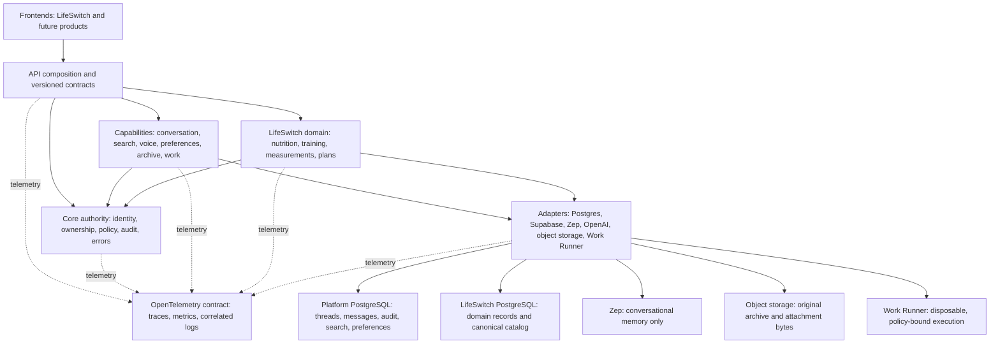

# SeeBx structural design map v1

Status: controlling cleanup map; no deployment, migration, or deletion authority

Evidence date: 2026-08-17 America/Chicago (2026-08-18 UTC)

Production authority: `49f9e60cf4321c8e42c359845c1a62a8c987614d`

Candidate evidence:

- Batch 01, dead Qdrant runtime surface: `10b5cb4a`
- Batch 02, core actor identity extraction: `fb252149`
- Batch 03, conversation memory contract extraction: `d06549df`
- Structural target, component, and database ledgers: `65a98f2a`
- Conversation persistence consolidation: `da426677`
- Voice synthetic canary contract repair: `e7005538`

The current runtime service, timer, container, database, and cron disposition is
tracked in `docs/SEEBX_RUNTIME_ASSET_LEDGER_V1.md`.

## Purpose

This map is the organizing boundary for cleanup. It answers four questions for
every retained file, route, database object, service, and external product:

1. Which structural plane owns it?
2. What is it allowed to depend on?
3. Is it canonical, transitional, derived, or retired?
4. What evidence is required before it moves or disappears?

The map prevents cleanup from becoming a sequence of local patches. A file is
not retained because it is old or deleted because its name is stale. It is
classified against a declared capability, authority boundary, caller, data
owner, and replacement path.

## Target system map



### Plane ownership

| Plane | Owns | Must not own |
|---|---|---|
| Frontend | presentation, local interaction state, product UX | identity authority, database credentials, provider secrets, cross-owner policy |
| API composition | route mounting, request/response translation, contract versions | domain SQL, prompt construction, provider clients, retirement stubs |
| Core authority | verified actor, owner binding, authorization, audit envelope, stable errors | product behavior, provider selection, SQL queries |
| Capability | one use-case service and its contracts | another capability's router, raw provider objects, hidden database fallback |
| Adapter | provider-specific API/SQL/runtime mechanics | product policy, caller identity inference, alternate business flows |
| Data | canonical records or explicitly derived provider state | ambiguous duplicate write authority |
| Work Runner | disposable workspace and approved tool execution | production credentials, production checkout mutation, deployment authority |
| Observability | correlated evidence about execution | authorization decisions or canonical product data |

## Dependency rules

Allowed production dependency direction:

```text
frontend -> versioned API contract
router -> core authority + capability service
capability service -> contract + adapter interface
adapter -> external provider or declared database
all planes -> telemetry interface
```

Forbidden crossings:

- router to raw SQL or provider SDK;
- capability to another capability's router;
- reusable core to LifeSwitch domain code;
- response orchestration to nutrition/training SQL;
- Zep or a vector store acting as transcript, identity, deletion, or domain-data authority;
- LifeSwitch database fallback to the platform database;
- frontend state or request fields acting as owner authority;
- SeeBx service invoking an unrestricted Work Runner shell;
- model-directed execution receiving production credentials or writable
  production mounts.

Temporary compatibility adapters are permitted only when they name their
remaining callers, have contract tests, emit usage evidence, and state an exact
retirement condition.

## Canonical control flows

### Ordinary API request

```text
request
  -> verified actor and owner context
  -> capability policy
  -> one capability service
  -> one or more narrow adapter interfaces
  -> canonical transaction/provider call
  -> stable response plus audit/telemetry
```

### Conversational response

```text
authenticated conversation snapshot
  -> optional Zep context
  -> optional domain/search context contracts
  -> one prompt/composition service
  -> model adapter
  -> durable response and provenance
  -> Zep update
```

There is one live response orchestrator. Experiments and historical versions
remain outside the deployed import graph until selected. Selection replaces a
path; it does not add another permanent router.

### Work job

```text
authenticated request
  -> SeeBx work policy and immutable job contract
  -> durable job record/queue
  -> Work Runner signed intake
  -> disposable repository copies and sandbox
  -> bounded tools
  -> artifacts, test evidence, and signed receipt
  -> human review/promotion gate
```

The control plane retains identity, approval, policy, audit, and promotion
authority. The sandbox owns only model-directed compute. A successful job is
candidate evidence, never production authority.

## Current-to-target seams

| Current seam | Target seam | Cleanup rule |
|---|---|---|
| `app.py` composition plus 36 direct routes and SQL | `seebx.main` plus capability routers/services | move one contract-tested route family at a time; keep external behavior stable |
| governed-memory actor types in live auth | `seebx.core.identity` | Batch 02 candidate completed; retain compatibility re-export only for named dormant callers |
| `resse_response_router.py` and 72-module closure | `capabilities.conversation` | extract generic response contracts, then select one Zep-aware composition flow |
| separate trusted-web, search, and news engines | one search capability with policy profiles | preserve provider, source, cache, and audit behavior while removing duplicate orchestration |
| domain SQL reachable from response code | LifeSwitch capability read contracts | no direct cross-capability database access |
| old `memory` PostgreSQL plus isolated LifeSwitch PostgreSQL | clean platform PostgreSQL plus isolated LifeSwitch PostgreSQL | migrate only verified platform schemas; do not restore the retired database wholesale |
| provider and secret settings in service environment | validated config plus provider adapters and managed secret/config stores | fail closed when required values are absent; no fallback across stores |
| custom Work Runner contracts and rootless Podman | stable sandbox interface behind `adapters.work_runner` | preserve policy/receipt security; keep provider/runtime swappable |

## Product decision register

Products are adopted only when they remove more custom code and operational
risk than they add. Every product remains behind a narrow adapter and must have
owner isolation, export/deletion behavior, failure semantics, observability,
cost, and a replacement path documented.

| Product/capability | Decision | Advantages | Costs and risks | Gate |
|---|---|---|---|---|
| Supabase Auth | KEEP | proven identity service; JWTs integrate with PostgreSQL RLS; reduces custom account/security code | stale claims require token refresh; service credentials are high impact; RLS mistakes remain possible | preserve server-side verification, owner predicates, MFA/session policy, and never authorize from user-editable metadata |
| Supabase Postgres platform | EVALUATE AFTER CLEANUP | full PostgreSQL, managed backups/PITR options, RLS, branching and ecosystem integration | database migration and provider coupling; does not repair unclear schemas; storage objects need separate backup | first produce clean versioned platform migrations; compare managed Supabase with a clean self-managed database using the same adapter contract |
| Supabase Queues / `pgmq` | PILOT FOR JOB INTAKE | PostgreSQL-native durable queue, delivery/visibility semantics, archival and RLS controls | couples queue load to the database; not a full workflow engine; consumer idempotency and poison-message handling remain ours | use only after immutable work-job and receipt contracts exist; load/failure test before selection |
| Zep | KEEP, MEMORY ONLY | purpose-built temporal context graph and token-efficient memory retrieval; removes custom memory graph/vector pipeline | external data/control plane, usage cost, provider-specific deletion/export and availability behavior | verify owner/thread binding, deletion, export, retention, outage behavior, and provenance; never make it transcript or domain authority |
| OpenAI Responses API | KEEP BEHIND MODEL ADAPTER | hosted tools and function/MCP tool contracts reduce custom model-loop plumbing | provider dependence, usage cost, hosted-tool policy must remain subordinate to SeeBx authority | version our tool contracts and approvals independently; no direct provider object in capability code |
| OpenAI Agents SDK Sandbox | ALIGN INTERFACES; LIMITED PILOT | its harness/compute split, manifests, capabilities, snapshots, ports, and provider clients closely match Work Runner | sandbox support is beta; replacing our fail-closed policy/receipt layer would weaken current guarantees | keep current rootless Podman runner; make manifests/receipts compatible enough to pilot later without redesign |
| Rootless Podman | KEEP FOR CURRENT RUNNER | already installed; rootless, cgroup v2, overlay storage; local control and predictable cost | we own lifecycle, cleanup, image supply chain, networking, previews, and host capacity | continue digest pinning, no external egress by default, non-root containers, read-only roots, resource caps, and cleanup proof |
| Temporal | DEFER | excellent durable execution, replay, recovery, timers, and long-running workflow state | adds service/database/cloud dependency, deterministic-workflow constraints, worker operations, and migration complexity | reconsider only when Work jobs span restarts/human waits/retries often enough that queue plus job-state code becomes material |
| OpenTelemetry | ADOPT AS OBSERVABILITY CONTRACT | vendor-neutral traces, metrics, and correlated logs; avoids embedding one monitoring vendor | it is instrumentation/collection, not a storage or alerting backend; cardinality and sensitive attributes require discipline | define trace/job/request IDs and redaction first; select a backend separately after a small SeeBx/Runner pilot |
| AWS Parameter Store | ADOPT FOR NON-ROTATING CONFIG | IAM, versioning, hierarchy, encryption option, EC2/SSM integration | AWS coupling, retrieval availability/throughput, `SecureString` is not a rotation system | store endpoints, identifiers, and low-change encrypted values; cache safely and fail closed |
| AWS Secrets Manager | ADOPT FOR ROTATING SECRETS | secret lifecycle and automatic rotation support with IAM/audit integration | added cost and rotation complexity; rotation must update the target service as well | use for database/provider credentials that need rotation; never place plaintext secrets in job manifests or model context |
| Archive/document platform | DECIDE SEPARATELY | an existing product may provide ingestion, OCR, mapping, retention, and export | archive requirements differ from chat memory; product choice can create another opaque data silo | freeze archive requirements and data authority before comparing products; original bytes belong in object storage with PostgreSQL metadata |
| Custom forms engine | DO NOT REBUILD YET | avoids preserving an unsafe request-owner implementation | a new generic forms system can become a large unrelated platform | first decide whether product forms remain; prefer a proven schema-driven product only if owner/RLS and export requirements fit |

## File and object classification method

Every source file, route, frontend caller, SQL object, service, timer, setting,
container, volume, and snapshot receives these fields:

```text
object_id
object_type
current_path_or_name
current_runtime_reachability
mounted_or_invoked_by
structural_plane
target_capability
canonical_data_owner
disposition: KEEP | MOVE | MERGE | REPLACE | ARCHIVE | RETIRE | DECIDE
replacement_or_destination
tests_and_consumers
retirement_gate
evidence_commit
```

Classification rules:

1. Runtime reachability is evidence, not disposition. Dormant code may still be
   migration or rollback authority; reachable code may still be obsolete glue.
2. Generic behavior inside a retired package is extracted before the package is
   archived or retired.
3. Duplicate implementations are compared at the contract and behavior level;
   useful fragments are merged into one owner rather than keeping parallel
   routers.
4. Data objects require caller, function, trigger, ACL/RLS, retention, and
   backup evidence in addition to source-code scans.
5. Historical tests and documents leave the active repository only after their
   controlling or rollback value is explicitly replaced.
6. Deletion is always a separate authorized batch with exact targets and
   recovery evidence.

## Cleanup sequence controlled by this map

| Wave | Scope | Exit evidence |
|---:|---|---|
| 0 | freeze production, route/import/SQL/service/Git inventory | reproducible baseline and component ledger |
| 1 | remove false Qdrant runtime surface | Batch 01 candidate and tests |
| 2 | extract actor identity from retired memory package | Batch 02 candidate and tests |
| 3 | extract response provider/provenance contracts and choose one composition path | no live governed-memory/successor imports; response equivalence tests |
| 4 | consolidate search, current-news, and trusted-web orchestration | one provider/audit/cache pipeline; frontend contract tests |
| 5 | split `app.py`, domain services, and SQL adapters | no router SQL; one router/service per capability |
| 6 | create clean platform migrations and decouple chat deletion from the memory outbox | disposable DB parity, cross-owner denial, replay, backup, rollback |
| 7 | resolve preferences, forms, export, archive, telemetry, and job queue decisions | explicit keep/rebuild/product/retire decisions and tests |
| 8 | prove zero dependency and archive/delete retired code, schemas, settings, services, volumes, and old snapshots | exact retirement manifests and post-removal verification |
| 9 | snapshot clean state, verify Git/GitHub, then connect SeeBx to Work Runner | encrypted recovery, clean remote state, signed job/receipt integration |

Only one behavioral seam moves in a batch. No cleanup wave combines a data
migration, large code consolidation, provider change, and production activation.

## Completion condition

The structural cleanup is complete when the generated ledger has no unexplained
object, every active capability follows the allowed dependency direction, each
canonical record has one owner, compatibility adapters have zero callers, all
retirements have recovery evidence, production and frontend contract tests
pass, and the clean Git/GitHub state plus encrypted snapshot are verified.
